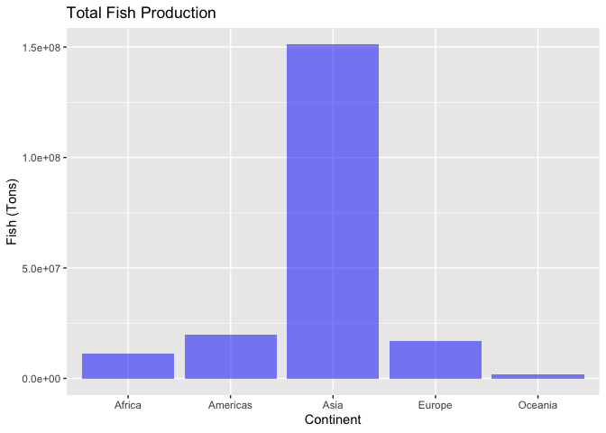
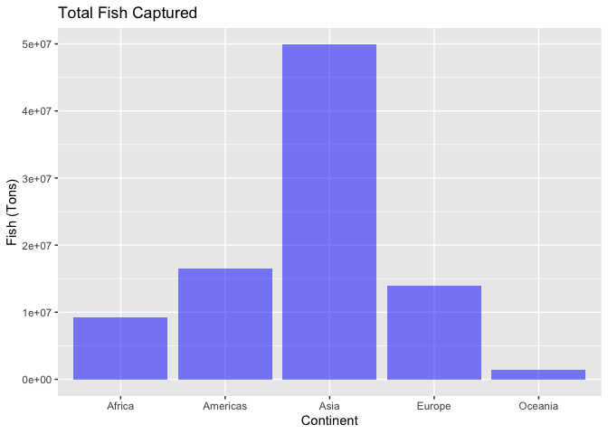
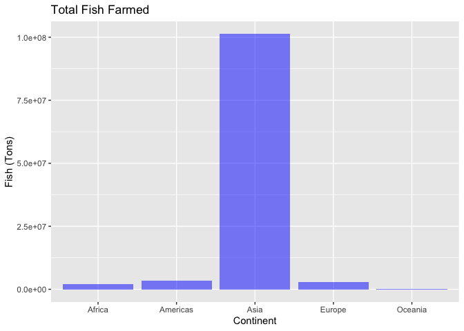
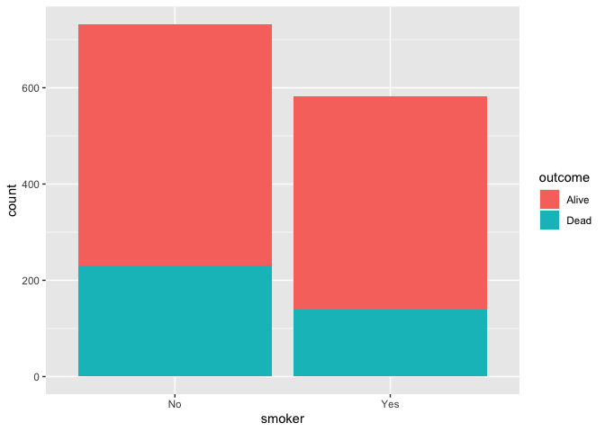
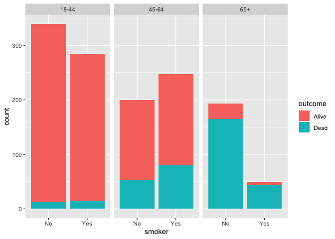

Lab 06 - Ugly charts and Simpson’s paradox
================
Conor Lacey
02-19-23

### Load packages and data

``` r
suppressWarnings(library(tidyverse))
library(dsbox)
library(mosaicData) 
```

    ## Warning: package 'mosaicData' was built under R version 4.1.2

### Exercise 1

``` r
staff <- read_csv("data/instructional-staff.csv")
```

    ## Rows: 5 Columns: 12
    ## ── Column specification ────────────────────────────────────────────────────────
    ## Delimiter: ","
    ## chr  (1): faculty_type
    ## dbl (11): 1975, 1989, 1993, 1995, 1999, 2001, 2003, 2005, 2007, 2009, 2011
    ## 
    ## ℹ Use `spec()` to retrieve the full column specification for this data.
    ## ℹ Specify the column types or set `show_col_types = FALSE` to quiet this message.

I believe that there will be 11 rows of data when we convert this data
to long format.

``` r
staff_long <- staff %>%
  pivot_longer(cols = -faculty_type, names_to = "year") %>%
  mutate(value = as.numeric(value))

staff_long
```

    ## # A tibble: 55 × 3
    ##    faculty_type              year  value
    ##    <chr>                     <chr> <dbl>
    ##  1 Full-Time Tenured Faculty 1975   29  
    ##  2 Full-Time Tenured Faculty 1989   27.6
    ##  3 Full-Time Tenured Faculty 1993   25  
    ##  4 Full-Time Tenured Faculty 1995   24.8
    ##  5 Full-Time Tenured Faculty 1999   21.8
    ##  6 Full-Time Tenured Faculty 2001   20.3
    ##  7 Full-Time Tenured Faculty 2003   19.3
    ##  8 Full-Time Tenured Faculty 2005   17.8
    ##  9 Full-Time Tenured Faculty 2007   17.2
    ## 10 Full-Time Tenured Faculty 2009   16.8
    ## # … with 45 more rows

``` r
staff_long %>%
  ggplot(aes(x = year,
             y = value,
             group = faculty_type,
             color = faculty_type)) +
  geom_line()+
  labs(title = "Trends in Instructional Staff Employees",
       x = "Year",
       y = "Percentage of Hires",
       color = "Faculty Type")
```

<!-- -->

To make it so that the graph highlights that the proportion of part-time
faculty has gone up over the years in comparison to other faculty types,
I would keep the part-time faculty line as its own line and consolidate
the other faculty types into one line. The consolidated line should be
lower than the part-time faculty line.

### Exercise 2

``` r
fisheries <- read_csv("data/fisheries.csv")
```

    ## Rows: 216 Columns: 4
    ## ── Column specification ────────────────────────────────────────────────────────
    ## Delimiter: ","
    ## chr (1): country
    ## dbl (3): capture, aquaculture, total
    ## 
    ## ℹ Use `spec()` to retrieve the full column specification for this data.
    ## ℹ Specify the column types or set `show_col_types = FALSE` to quiet this message.

``` r
fisheries
```

    ## # A tibble: 216 × 4
    ##    country             capture aquaculture  total
    ##    <chr>                 <dbl>       <dbl>  <dbl>
    ##  1 Afghanistan            1000        1200   2200
    ##  2 Albania                7886         950   8836
    ##  3 Algeria               95000        1361  96361
    ##  4 American Samoa         3047          20   3067
    ##  5 Andorra                   0           0      0
    ##  6 Angola               486490         655 487145
    ##  7 Antigua and Barbuda    3000          10   3010
    ##  8 Argentina            755226        3673 758899
    ##  9 Armenia                3758       16381  20139
    ## 10 Aruba                   142           0    142
    ## # … with 206 more rows

I think to improve the initial visualization of this data, we should
first use continents instead of countries to track fish production
around the globe. There is simply too many categorical variables (i.e.,
countries) to put on the x axis. The data should be condensed. I do not
see the sense in including all 216 countries as this makes it appear in
the initial visualization that the x axis is a continuous variable when
it is not!

Therefore I am going to create a new variable for continent

``` r
library(countrycode)
```

    ## Warning: package 'countrycode' was built under R version 4.1.2

This library contains countrycode, a function that is able to assign the
correct continent to countries. This will assist me in creating this
variable

``` r
fisheries <- fisheries %>% mutate(continent = countrycode(sourcevar = fisheries$country,
                            origin = "country.name",
                            destination = "continent"))
```

    ## Warning in countrycode_convert(sourcevar = sourcevar, origin = origin, destination = dest, : Some values were not matched unambiguously: Jersey and Guernsey

    ## Warning in countrycode_convert(sourcevar = sourcevar, origin = origin, destination = dest, : Some strings were matched more than once, and therefore set to <NA> in the result: Jersey and Guernsey,Europe,Europe

``` r
fisheries
```

    ## # A tibble: 216 × 5
    ##    country             capture aquaculture  total continent
    ##    <chr>                 <dbl>       <dbl>  <dbl> <chr>    
    ##  1 Afghanistan            1000        1200   2200 Asia     
    ##  2 Albania                7886         950   8836 Europe   
    ##  3 Algeria               95000        1361  96361 Africa   
    ##  4 American Samoa         3047          20   3067 Oceania  
    ##  5 Andorra                   0           0      0 Europe   
    ##  6 Angola               486490         655 487145 Africa   
    ##  7 Antigua and Barbuda    3000          10   3010 Americas 
    ##  8 Argentina            755226        3673 758899 Americas 
    ##  9 Armenia                3758       16381  20139 Asia     
    ## 10 Aruba                   142           0    142 Americas 
    ## # … with 206 more rows

This method has proven successful. Now because I also want to sum the
total fish production for each continent and not each country, I will
create a new variables that shows the total for each continent for
capture, aquaculture, and continent.

``` r
fisheries <- fisheries %>% group_by(continent) %>% 
  mutate(capture_continent = sum(capture))
fisheries <- fisheries %>% group_by(continent) %>% 
  mutate(aquaculture_continent = sum(aquaculture))
fisheries <- fisheries %>% group_by(continent) %>% 
  mutate(total_continent = sum(total))
```

Now I will create a separate data frame that looks at only the
continents.

``` r
fisheries<- as.data.frame(fisheries)

Africa<-fisheries %>% filter(continent=="Africa")
Americas<-fisheries %>% filter(continent=="Americas")
Asia<-fisheries %>% filter(continent=="Asia")
Europe<-fisheries %>% filter(continent == "Europe")
Oceania<-fisheries %>% filter(continent == "Oceania")

fisheries_continent<-data.frame(continent = c("Africa",
                         "Americas",
                         "Asia",
                         "Europe",
                         "Oceania"),
           Capture = c(Africa[1,6],
                       Americas[1,6],
                       Asia[1,6],
                       Europe[1,6],
                       Oceania[1,6]),
           Aquaculture = c(Africa[1,7],
                       Americas[1,7],
                       Asia[1,7],
                       Europe[1,7],
                       Oceania[1,7]),
           Total = c(Africa[1,8],
                       Americas[1,8],
                       Asia[1,8],
                       Europe[1,8],
                       Oceania[1,8])
)
```

Alright now I will construct a basic bar graph here. However, I know
these kinds of graphs are boring, but considering the goal of this graph
is compare fish production in different areas of the world this seems to
be the best method. I will make three for capture, aquaculture, and
total.

``` r
fisheries_continent %>% ggplot(aes(x = continent, y = Total)) +
  geom_bar(stat = "identity", fill = "blue", alpha =0.5) +
  labs(title = "Total Fish Production",
       x = "Continent",
       y = "Fish (Tons)")
```

<!-- -->

``` r
fisheries_continent %>% ggplot(aes(x = continent, y = Capture)) +
  geom_bar(stat = "identity", fill = "blue", alpha =0.5) + 
   labs(title = "Total Fish Captured",
       x = "Continent",
       y = "Fish (Tons)")
```

<!-- -->

``` r
fisheries_continent %>% ggplot(aes(x = continent, y = Aquaculture)) +
  geom_bar(stat = "identity", fill = "blue", alpha =0.5) +
   labs(title = "Total Fish Farmed",
       x = "Continent",
       y = "Fish (Tons)")
```

<!-- -->

The only other thing I want to add to these plots is changing the
display of the y-axis. I don’t like the e+ symboling, however I’m unsure
how to change this.

### Exercise 3

``` r
data(Whickham)
```

1.  This is observational data as there is no independent variable being
    manipulated prior to measuring a dependent variables. They are just
    observing survey responses in data.

2.  There are 1314 observations in the dataset. Each observation is a
    woman in Whickham.

3.  There are 3 variables. 1) Outcome survival status 2) Smoking
    status 3) Age

4.  I believe there should a negative relationship between smoking
    status and health outcome such that individuals who marked
    themselves are smoking are more likely to have died.

5.  

``` r
Whickham %>% ggplot(aes(x=smoker, fill = outcome))+
  geom_histogram(stat = "count")
```

    ## Warning in geom_histogram(stat = "count"): Ignoring unknown parameters:
    ## `binwidth`, `bins`, and `pad`

<!-- -->

6.  

``` r
Whickham %>%
  count(smoker, outcome)
```

    ##   smoker outcome   n
    ## 1     No   Alive 502
    ## 2     No    Dead 230
    ## 3    Yes   Alive 443
    ## 4    Yes    Dead 139

``` r
Yes = 443 + 139
No = 502 + 230

YesDead = 139
NoDead = 230

Proportion_of_Dead_Smokers <- YesDead/Yes
Proportion_of_Dead_NonSmokers <- NoDead/No

SmokerProps<-data.frame(Proportion_of_Dead_Smokers, Proportion_of_Dead_NonSmokers)
SmokerProps
```

    ##   Proportion_of_Dead_Smokers Proportion_of_Dead_NonSmokers
    ## 1                  0.2388316                     0.3142077

Interesting there is a greater proportion of people who are dead and
didn’t smoke versus people are dead and did smoke. Not at all my
expectations.

7.  

``` r
Whickham <- Whickham %>% mutate(age_cat = case_when(
  age <= 44 ~ "18-44",
  age > 44 & age <= 64 ~ "45-64",
  age > 64 ~ "65+"
))

Whickham %>% ggplot(aes(x=smoker, fill = outcome))+
  facet_wrap(~age_cat)+
  geom_histogram(stat = "count")
```

    ## Warning in geom_histogram(stat = "count"): Ignoring unknown parameters:
    ## `binwidth`, `bins`, and `pad`

<!-- -->

``` r
Whickham %>%
  count(smoker, age_cat, outcome)
```

    ##    smoker age_cat outcome   n
    ## 1      No   18-44   Alive 327
    ## 2      No   18-44    Dead  12
    ## 3      No   45-64   Alive 147
    ## 4      No   45-64    Dead  53
    ## 5      No     65+   Alive  28
    ## 6      No     65+    Dead 165
    ## 7     Yes   18-44   Alive 270
    ## 8     Yes   18-44    Dead  15
    ## 9     Yes   45-64   Alive 167
    ## 10    Yes   45-64    Dead  80
    ## 11    Yes     65+   Alive   6
    ## 12    Yes     65+    Dead  44

It appears here that my original prediction holds for ages 45-64. There
are more people who check yes to smoking and are dead relative to the
total than individuals who checked no to smoking and are dead relative
to the total. I feel the only reasonable explanation here is this, most
people begin smoking early in their life (18-44) when they are young and
healthy, but cancer then begins to develop in middle age (45-64) where
individuals then begin to suffer the fatal effects of smoking.
Individuals who are left alive then proceed to their later years in life
(65+). This is further seen by the fact that there are less people
smoking at ages 65+, because most have already died.
